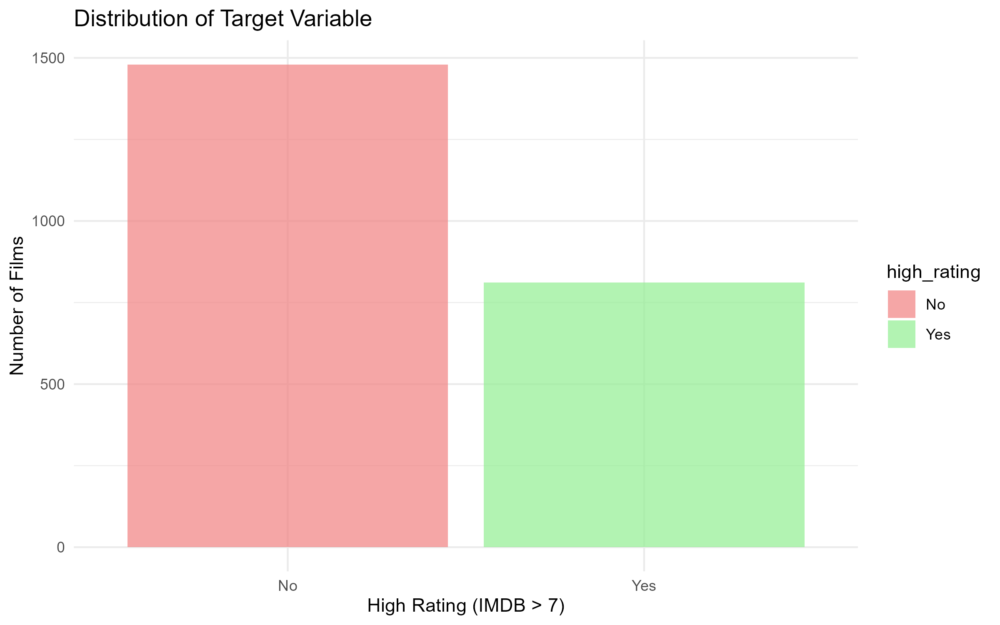
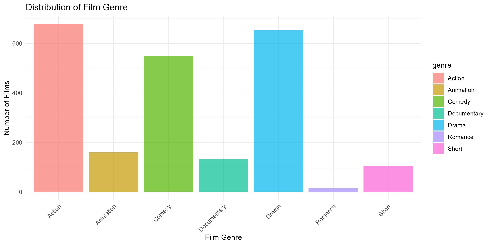
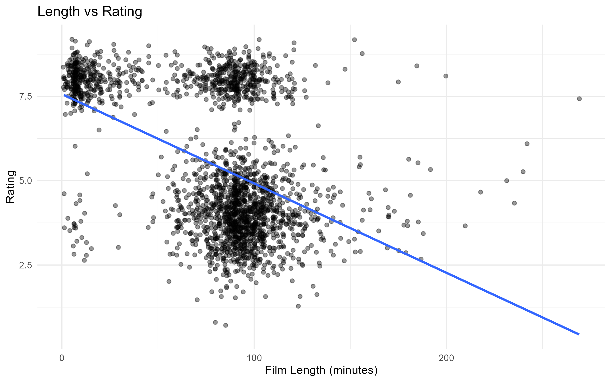
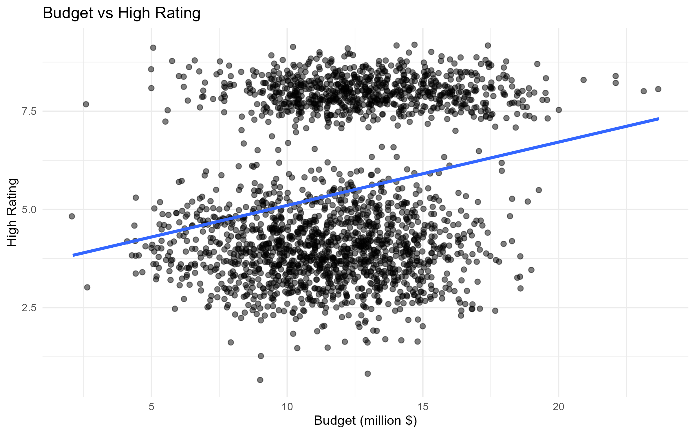
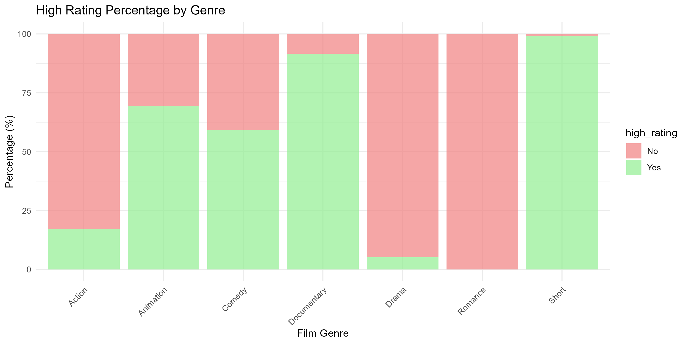
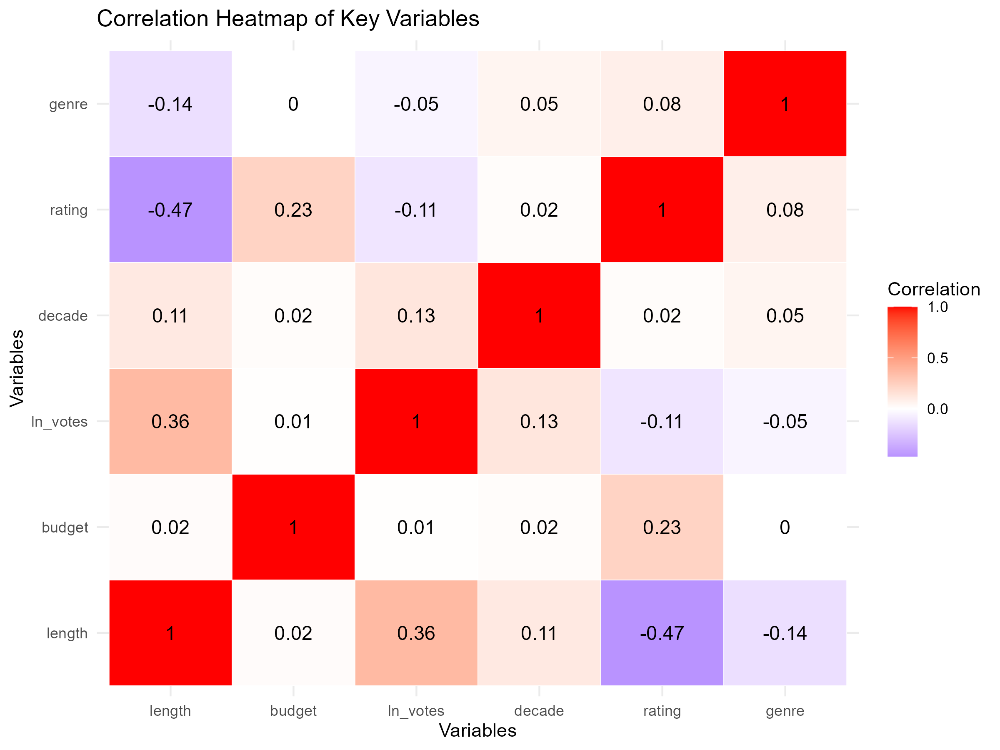

```{r setup, message=FALSE, warning=FALSE}
# Load the packages required for data handling, visualisation, and modelling
library(tidyverse)
library(ggplot2)
library(broom)
library(knitr)
library(pROC)
library(caret)
```

# Introduction

This report presents the group analysis of factors influencing IMDb film ratings using Generalised Linear Models (GLMs). The main objective of the project is to identify which film properties, including length, budget, votes, genre, and release year, are associated with whether a film receives an IMDb rating greater than 7.

The analysis is based on a subset of the IMDb film database (\`dataset07.csv\`) and combines data cleaning, exploratory data analysis, and statistical modelling. The report is organised into sections covering the dataset, exploratory findings, modelling approach, key results, and final conclusions.

# Data

```{r data-load}
# Load the original dataset from the data folder
df <- read.csv("Data/dataset07.csv")

# Show the dimensions of the original dataset
dim(df)
```

```{r data-cleaning}
# Create the binary target variable and remove rows with missing values
df_clean <- df %>%
  mutate(high_rating = ifelse(rating > 7, 1, 0)) %>%
  filter(!is.na(length), !is.na(budget))

# Remove invalid or extreme observations based on the cleaning rules
df_clean <- df_clean %>% 
  filter(
    length > 0 & length < 300,
    budget > 0 & budget < 50,
    votes >= 0,
    rating >= 0 & rating <= 10,
    !duplicated(film_id)
  )

# Show the dimensions of the cleaned dataset
dim(df_clean) 
```

```{r missing-summary}
# Count missing values in key variables
colSums(is.na(df[, c("length", "budget", "votes", "rating", "genre")]))
```

This project uses a subset of the IMDb film database (`dataset07.csv`) to investigate which film characteristics are associated with receiving a high IMDb rating. In this analysis, a high rating is defined as an IMDb score above 7 and is treated as a binary target variable (`high_rating`).

The main variables used in the analysis include release year (`year`), film duration in minutes (`length`), production budget in million USD (`budget`), number of votes (`votes`), genre (`genre`), and IMDb rating (`rating`). During data preparation, observations that did not satisfy the cleaning rules were removed, including records with missing values and invalid or extreme values.

# Exploratory Data Analysis

```{r eda-summary}
# Show the dimensions of the original and cleaned datasets
dim(df)
dim(df_clean)

# Calculate the number of observations removed during data cleaning
nrow(df) - nrow(df_clean)
```

The exploratory data analysis was conducted to summarize the cleaned dataset and identify preliminary relationships between predictors and IMDb rating outcomes. The original dataset contained 2,387 observations, and the final cleaned dataset used for analysis contained 2,292 observations. This means that 95 observations were removed during data preparation after applying the cleaning rules.

The cleaned dataset contained the main variables used in later analysis, including release year, film length, production budget, number of votes, genre, and IMDb rating. A binary target variable, `high_rating`, was defined according to whether the IMDb score exceeded 7.

## Target Variable Distribution

The target variable distribution shows that films without a high IMDb rating outnumber those classified as highly rated. This indicates that the dataset is moderately imbalanced, with highly rated films forming the minority class. This pattern should be considered when interpreting the classification results.

{width="85%" fig-cap="Distribution of the target variable."}

## Genre Distribution

The genre distribution is uneven across the dataset. Action and Drama appear most frequently, whereas Romance and Short are represented by relatively few observations. This suggests that genre-level comparisons may partly reflect differences in sample size across categories.

{width="85%" fig-cap="Distribution of film genres in the cleaned dataset."}

## Length vs Rating

The scatter plot suggests a negative relationship between film length and IMDb rating. Although the observations are widely dispersed, the downward trend line indicates that longer films tend to receive lower ratings on average. This pattern is consistent with the later modelling result in which length has a negative coefficient.

{width="85%" fig-cap="Relationship between film length and IMDb rating."}

## Budget vs Rating

The relationship between production budget and IMDb rating appears to be weakly positive. Films with larger budgets are somewhat more likely to achieve higher ratings, although the spread of points shows that budget alone does not strongly determine rating outcomes. This suggests that other characteristics also contribute to variation in ratings.

{width="85%" fig-cap="Relationship between production budget and IMDb rating."}

## Genre vs High Rating

The proportion of highly rated films varies substantially by genre. Documentary and Short show relatively high percentages of high-rated films, while Action and Romance have lower proportions. This indicates that genre may be an important predictor of whether a film receives a high IMDb rating.

{width="85%" fig-cap="High-rating percentage across film genres."}

## Correlation Heatmap

The proportion of highly rated films varies substantially by genre. Documentary and Short show relatively high percentages of high-rated films, while Action and Romance have lower proportions. This indicates that genre may be an important predictor of whether a film receives a high IMDb rating.

{width="85%" fig-cap="Correlation heatmap of key variables."}

# Methods

```{r model-data}
# Prepare the cleaned data for modelling
film <- df_clean %>%
  mutate(
    high_rating = factor(ifelse(high_rating == 1, "Yes", "No")),
    genre = factor(genre)
  )
# Fit the final logistic regression model
final.model <- glm(
  high_rating == "Yes" ~ length + length:budget + log(votes) + genre,
  family = binomial(link = "logit"),
  data = film
)
```

```{r model-summary}
# Display the summary of the final model
summary(final.model)
```

The modelling stage used Generalised Linear Models (GLMs) with a binomial family and logit link to examine the probability that a film receives a high IMDb rating. In this project, the response variable was `high_rating`, where films with a rating above 7 were coded as “Yes” and the others as “No”.

Several candidate models were fitted and compared by progressively removing or adjusting predictors from the full model. The predictors considered in the modelling process included film length, budget, log-transformed votes, decade, and genre. Based on model comparison, the final model selected was Model 4, which included `length`, the interaction term `length:budget`, `log(votes)`, and `genre`.

# Results

The final logistic regression model was evaluated using predicted probabilities, the ROC curve, a confusion matrix, and summary performance metrics. These outputs provide a broader assessment of model performance than coefficient interpretation alone.

## Prediction Probability vs True Value

```{r prediction-data, echo=TRUE, message=FALSE, warning=FALSE}
# Generate predicted probabilities from the final model
film$high_rating_probability <- predict(final.model, type = "response")
# Plot predicted probabilities against the observed outcome
ggplot(film, aes(x = high_rating_probability, y = high_rating)) +
  geom_jitter(height = 0.15, width = 0, alpha = 0.4) +
  theme_minimal() +
  xlab("High Rating Prediction Probability") +
  ylab("True High Rating Value") +
  ggtitle("True High Rating Value vs High Rating Prediction Probability by Using the Point Shape")
```
The predicted probability plot shows that films in the high-rating group generally receive higher fitted probabilities than films in the low-rating group. Although overlap remains between the two outcome classes, the model demonstrates a reasonable ability to distinguish highly rated films from those that are not highly rated.

## ROC Curve
```{r roc-curve, echo=TRUE, message=FALSE, warning=FALSE}
# Generate the ROC curve
ROC <- film |>
  roc(high_rating, high_rating_probability, levels = c("No", "Yes"))

ggroc(ROC, colour = "skyblue", linewidth = 1, legacy.axes = TRUE) +
  geom_abline(slope = 1, intercept = 0, colour = "black", linewidth = 1) +
  coord_fixed() +
  theme_minimal() +
  xlab("False Positive Rate") +
  ylab("True Positive Rate") +
  ggtitle(paste("ROC Curve (AUC =", round(auc(ROC), 4), ")"))
```
The ROC curve summarises the classification performance of the model across all possible thresholds. The AUC value indicates that the model performs better than random classification and has useful discriminatory ability in separating highly rated films from non-highly rated films.

## Confusion Matrix and Model Evaluation Table

```{r confusion-matrix, echo=TRUE, message=FALSE, warning=FALSE}
# Generate the confusion matrix using a threshold of 0.5
confusion.matrix <- confusionMatrix(
  factor(ifelse(film$high_rating_probability >= 0.5, "Yes", "No"),
         levels = c("No", "Yes")),
  factor(film$high_rating, levels = c("No", "Yes")),
  positive = "Yes"
)

confusion.matrix
```
```{r model-evaluation-table, echo=TRUE, message=FALSE, warning=FALSE}
# Generate the model evaluation table
tibble(
  Model = "Logistic Regression Model",
  Accuracy = confusion.matrix$overall["Accuracy"],
  Precision = confusion.matrix$byClass["Precision"],
  Recall = confusion.matrix$byClass["Recall"],
  F1 = confusion.matrix$byClass["F1"],
  AUC = as.numeric(auc(ROC))
) |>
  kable(digits = 3, caption = "Model Evaluation")
```
The confusion matrix provides a direct comparison between predicted and observed classes at the selected threshold, showing how many films were classified correctly and incorrectly. The model evaluation table further summarises performance using accuracy, precision, recall, F1 score, and AUC, providing a more complete assessment of classification quality than accuracy alone.

# Conclusion

This report examined the factors associated with receiving a high IMDb rating using exploratory data analysis and Generalised Linear Models. The findings suggest that film length, number of votes, genre, and the interaction between length and budget all played an important role in explaining whether a film was highly rated.

Overall, the analysis shows that highly rated films cannot be explained by a single factor alone. Instead, both film characteristics and audience response contribute to rating outcomes. The results provide a useful summary of the main patterns in the dataset and demonstrate how statistical modelling can be used to investigate film rating behaviour.
