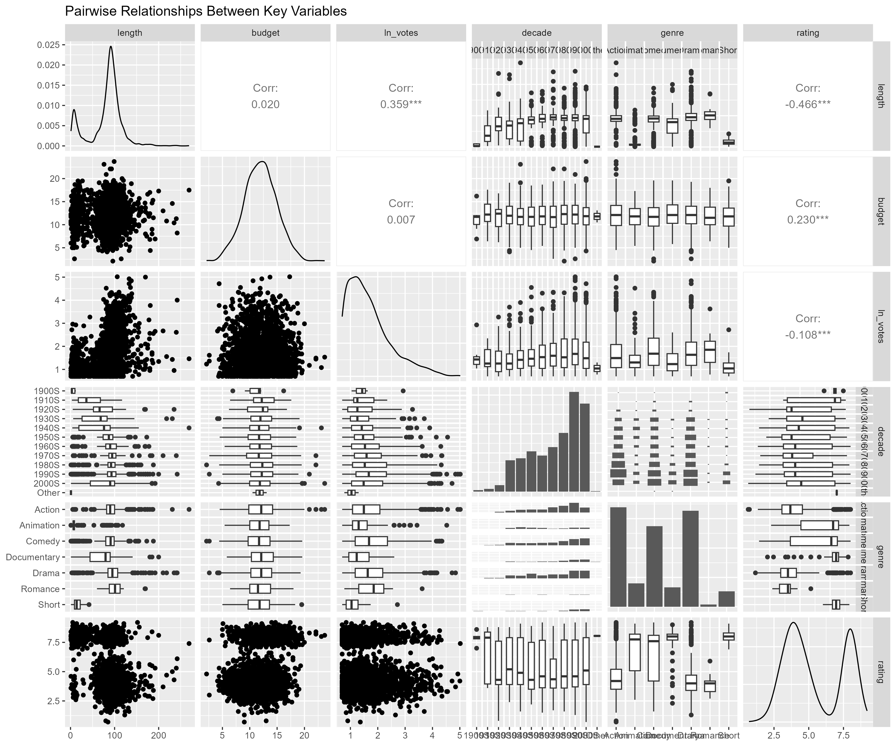

# Introduction

This report presents the group analysis of factors influencing IMDb film ratings using Generalised Linear Models (GLMs). The main objective of the project is to identify which film properties, including length, budget, votes, genre, and release year, are associated with whether a film receives an IMDb rating greater than 7.

The analysis is based on a subset of the IMDb film database (\`dataset07.csv\`) and combines data cleaning, exploratory data analysis, and statistical modelling. The report is organised into sections covering the dataset, exploratory findings, modelling approach, key results, and final conclusions.

# Data

This project uses a subset of the IMDb film database (`dataset07.csv`) to investigate which film characteristics are associated with receiving a high IMDb rating. In this analysis, a high rating is defined as an IMDb score above 7 and is treated as a binary target variable (`high_rating`).

The main variables used in the analysis include release year (`year`), film duration in minutes (`length`), production budget in million USD (`budget`), number of votes (`votes`), genre (`genre`), and IMDb rating (`rating`). During data preparation, rows with missing values in the key variables were removed, obvious outliers were filtered out, categorical variables were converted to factor type, and a log-transformed votes variable was created for modelling.

# Exploratory Data Analysis

The exploratory data analysis (EDA) was conducted to examine the distribution of the target variable and the relationships between predictors and film ratings. According to the project workflow, this stage included univariate analysis of the target variable, numerical predictors, and genre, bivariate analysis between predictors and `high_rating`, and correlation analysis among numerical variables.

The main visual outputs include the distribution of the target variable, the distribution of film genre, scatter plots of length and budget against rating, a genre-based comparison of high-rating percentages, a correlation heatmap, and a ggpairs plot of key variables. 

## Target Variable Distribution

{width="85%" fig-cap="Distribution of the target variable."}

## Genre Distribution

{width="85%" fig-cap="Distribution of film genres in the cleaned dataset."}

## Length vs Rating

{width="85%" fig-cap="Relationship between film length and IMDb rating."}

## Budget vs Rating

{width="85%" fig-cap="Relationship between production budget and IMDb rating."}

## Genre vs High Rating

{width="85%" fig-cap="High-rating percentage across film genres."}

## Correlation Heatmap

{width="85%" fig-cap="Correlation heatmap of key variables."}

## Pairwise Relationships

{width="100%" fig-cap="Pairwise relationships between key variables."}

# Methods

The modelling stage used Generalised Linear Models (GLMs) with a binomial family and logit link to examine the probability that a film receives a high IMDb rating. In this project, the response variable was `high_rating`, where films with a rating above 7 were coded as “Yes” and the others as “No”.

Several candidate models were fitted and compared by progressively removing or adjusting predictors from the full model. The predictors considered in the modelling process included film length, budget, log-transformed votes, decade, and genre. Based on model comparison, the final model selected was Model 4, which included `length`, the interaction term `length:budget`, `log(votes)`, and `genre`.

# Results

The final selected model was Model 4. According to the model summary, several predictors were statistically significant. Film length had a significant negative coefficient, suggesting that longer films were associated with a lower probability of receiving a high IMDb rating when other variables were held constant. In contrast, log-transformed votes had a significant positive coefficient, indicating that films with more votes were more likely to be highly rated.

Genre also showed important differences in predicted high-rating probability. Compared with the reference genre, Animation, Comedy, Documentary, Drama, and Short had significant effects, while Romance was not statistically significant. In addition, the interaction term between length and budget was significant, suggesting that the relationship between film length and high rating may vary depending on production budget.

The final model had an AIC value of 1244.5, with residual deviance substantially lower than the null deviance, indicating improved model fit compared with the intercept-only model.

# Conclusion

This report examined the factors associated with receiving a high IMDb rating using exploratory data analysis and Generalised Linear Models. The findings suggest that film length, number of votes, genre, and the interaction between length and budget all played an important role in explaining whether a film was highly rated.

Overall, the analysis shows that highly rated films cannot be explained by a single factor alone. Instead, both film characteristics and audience response contribute to rating outcomes. The results provide a useful summary of the main patterns in the dataset and demonstrate how statistical modelling can be used to investigate film rating behaviour.
